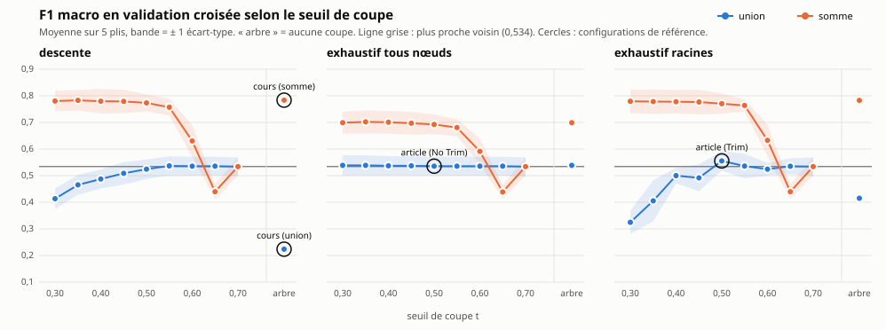

# Grille d'options en validation croisée

Représentation × structure × classification, comparées sur l'entraînement seul. Une configuration sera retenue pour l'évaluation sur le test, qui n'a pas encore été lu.

## 1. Dispositif

- **Validation croisée** sur les 750 exemples d'entraînement : 5 plis stratifiés par type (10 exemples par type et par pli), `random.Random(42)`. **Le test n'est pas lu.**
- Pour chaque pli et chaque représentation, **un arbre complet par type** est construit sur les 4 autres plis (40 exemples par type) ; toutes les coupes et les trois classifications en découlent.
- **Représentations** : « union » (ensemble des symboles, `similarite()` inchangée) et « somme » (comptes par symbole, cosinus sur vecteurs — revient à comparer au centroïde). Un exemple à classer est un vecteur de 1.
- **Structures** : l'arbre complet, et la forêt coupée à t = 0,30 … 0,70 par pas de 0,05. La forêt à t garde les fusions effectuées **avant la première fusion de lien < t** : l'ordre des fusions fait foi, pas les hauteurs, que les inversions rendent non monotones.
- **Classifications** : descente dans chaque arbre de la forêt ; exhaustif sur tous les nœuds de la forêt (No Trim) ; exhaustif sur ses racines, orphelines comprises (Trim). Score : formule 3, moyenne des deux côtés. Lien de construction : minimum des deux côtés.
- **Nombre de calculs** : scores que la méthode calcule seule pour un exemple. La grille, elle, calcule chaque nœud une fois et le relit.
- **Écart-type** : sur les 5 valeurs de F1 des plis, dénominateur n − 1.
- Durée totale : 20 s.

## 2. Les configurations de référence

L'article est « union + forêt à 0,50 + exhaustif » ; ses deux variantes d'exhaustif sont données, Trim étant son réglage principal. La méthode du cours — arbre complet + descente — ne fixe pas la représentation : les deux sont données.

| référence | configuration | rang | F1 moyen ± é.-t. | prédictions internes | prédictions par une racine | poids relatif gagnant | calculs / exemple |
|---|---|---|---|---|---|---|---|
| **article (Trim)** | union · forêt 0,50 · exhaustif racines | 25 / 61 | 0,555 ± 0,037 | 32,7 % | 100 % | 0,04 | 370 |
| **article (No Trim)** | union · forêt 0,50 · exhaustif tous nœuds | 37 / 61 | 0,536 ± 0,036 | 1,6 % | 23 % | 0,03 | 830 |
| **cours (union)** | union · arbre · descente | 61 / 61 | 0,224 ± 0,039 | 9,6 % | 0 % | 0,03 | 89 |
| **cours (somme)** | somme · arbre · descente | 1 / 61 | 0,784 ± 0,042 | 99,3 % | 50 % | 0,96 | 68 |
| **plus proche voisin** | plus proche voisin (feuilles) | 46 / 61 | 0,534 ± 0,035 | 0,0 % | 100 % | 0,03 | 600 |

« poids relatif gagnant » : poids du nœud qui fait la prédiction divisé par le nombre d'exemples de son type, en moyenne. 1 = le nœud couvre tout le type ; 1/40 = une feuille.

## 3. Meilleure configuration

**somme · arbre · descente** : F1 0,784 ± 0,042.

Configurations qui ne s'en distinguent pas au-delà d'un écart-type — F1 moyen ≥ 0,784 − 0,042 = 0,741 : **14** sur 61.

| rang | configuration | F1 moyen | écart-type | nœuds / type | racines / type | prédictions internes | poids relatif gagnant | calculs / exemple |
|---|---|---|---|---|---|---|---|---|
| 1 | somme · arbre · descente — **cours (somme)** | **0,784** | 0,042 | 79,0 | 1,0 | 99,3 % | 0,96 | 68 |
| 2 | somme · forêt 0,35 · descente | **0,783** | 0,039 | 78,5 | 1,5 | 99,3 % | 0,95 | 81 |
| 3 | somme · arbre · exhaustif racines | **0,783** | 0,048 | 79,0 | 1,0 | 100,0 % | 1,00 | 15 |
| 4 | somme · forêt 0,30 · descente | **0,780** | 0,039 | 78,8 | 1,2 | 99,3 % | 0,96 | 72 |
| 5 | somme · forêt 0,40 · descente | **0,780** | 0,046 | 78,2 | 1,8 | 99,3 % | 0,94 | 87 |
| 6 | somme · forêt 0,30 · exhaustif racines | **0,779** | 0,045 | 78,8 | 1,2 | 99,9 % | 0,99 | 18 |
| 7 | somme · forêt 0,45 · descente | **0,779** | 0,044 | 77,5 | 2,5 | 99,1 % | 0,93 | 97 |
| 8 | somme · forêt 0,35 · exhaustif racines | **0,778** | 0,046 | 78,5 | 1,5 | 99,9 % | 0,99 | 23 |
| 9 | somme · forêt 0,40 · exhaustif racines | **0,778** | 0,044 | 78,2 | 1,8 | 99,7 % | 0,98 | 28 |
| 10 | somme · forêt 0,45 · exhaustif racines | **0,777** | 0,046 | 77,5 | 2,5 | 99,3 % | 0,96 | 37 |
| 11 | somme · forêt 0,50 · descente | **0,773** | 0,032 | 75,2 | 4,8 | 98,1 % | 0,86 | 138 |
| 12 | somme · forêt 0,50 · exhaustif racines | **0,770** | 0,038 | 75,2 | 4,8 | 98,8 % | 0,90 | 72 |
| 13 | somme · forêt 0,55 · exhaustif racines | **0,764** | 0,022 | 72,0 | 8,0 | 97,2 % | 0,80 | 120 |
| 14 | somme · forêt 0,55 · descente | **0,757** | 0,031 | 72,0 | 8,0 | 96,9 % | 0,77 | 178 |

### 3.1 Lecture

- **La meilleure configuration prédit surtout par des nœuds très lourds.** 50 % de ses prédictions viennent d'une racine de la forêt, et le nœud gagnant couvre en moyenne 96 % de son type.
- **somme · arbre · exhaustif racines** compare l'exemple aux quinze seules racines, soit au centroïde de chaque type : F1 0,783 ± 0,048, pour 15 calculs. La meilleure configuration fait +0,001 par rapport à ce classifieur par centroïde. **L'essentiel du gain vient de la représentation somme, pas de l'arbre.**
- La même comparaison aux racines en union donne 0,415 ± 0,061 : en union, un symbole porté par un seul exemple du type pèse autant qu'un symbole porté par tous, et la racine est pénalisée pour chacun d'eux. En somme, la norme du nœud est dominée par les symboles que partagent beaucoup d'exemples : ce qui est typique du type compte, l'accidentel s'efface. C'est le biais de archive/rapport_arbres.md vu de l'autre côté — le gros nœud y perdait, il devient ici le meilleur candidat.
- La meilleure configuration en union est **union · forêt 0,50 · exhaustif racines**, F1 0,555 ± 0,037, rang 25.

## 4. F1 en fonction du seuil

Même contenu en tableau (F1 moyen ; l'écart-type est au tableau complet) :

| représentation | classification | 0,30 | 0,35 | 0,40 | 0,45 | 0,50 | 0,55 | 0,60 | 0,65 | 0,70 | arbre |
|---|---|---|---|---|---|---|---|---|---|---|---|
| union | descente | 0,413 | 0,465 | 0,487 | 0,509 | 0,524 | 0,537 | 0,536 | 0,536 | 0,534 | 0,224 |
| union | exhaustif tous nœuds | 0,539 | 0,539 | 0,537 | 0,537 | 0,536 | 0,536 | 0,536 | 0,536 | 0,534 | 0,539 |
| union | exhaustif racines | 0,325 | 0,405 | 0,500 | 0,492 | 0,555 | 0,536 | 0,524 | 0,535 | 0,534 | 0,415 |
| somme | descente | 0,780 | 0,783 | 0,780 | 0,779 | 0,773 | 0,757 | 0,630 | 0,440 | 0,534 | 0,784 |
| somme | exhaustif tous nœuds | 0,699 | 0,702 | 0,701 | 0,697 | 0,692 | 0,681 | 0,591 | 0,439 | 0,534 | 0,699 |
| somme | exhaustif racines | 0,779 | 0,778 | 0,778 | 0,777 | 0,770 | 0,764 | 0,633 | 0,440 | 0,534 | 0,783 |

Plus proche voisin : 0,534 ± 0,035.

## 5. Tableau complet

Trié par F1 moyen décroissant ; à égalité, la moins coûteuse d'abord. « nœuds / type » et « racines / type » sont moyennés sur les 15 types et les 5 plis.

| rang | configuration | F1 moyen | écart-type | nœuds / type | racines / type | prédictions internes | poids relatif gagnant | calculs / exemple |
|---|---|---|---|---|---|---|---|---|
| 1 | somme · arbre · descente — **cours (somme)** | **0,784** | 0,042 | 79,0 | 1,0 | 99,3 % | 0,96 | 68 |
| 2 | somme · forêt 0,35 · descente | **0,783** | 0,039 | 78,5 | 1,5 | 99,3 % | 0,95 | 81 |
| 3 | somme · arbre · exhaustif racines | **0,783** | 0,048 | 79,0 | 1,0 | 100,0 % | 1,00 | 15 |
| 4 | somme · forêt 0,30 · descente | **0,780** | 0,039 | 78,8 | 1,2 | 99,3 % | 0,96 | 72 |
| 5 | somme · forêt 0,40 · descente | **0,780** | 0,046 | 78,2 | 1,8 | 99,3 % | 0,94 | 87 |
| 6 | somme · forêt 0,30 · exhaustif racines | **0,779** | 0,045 | 78,8 | 1,2 | 99,9 % | 0,99 | 18 |
| 7 | somme · forêt 0,45 · descente | **0,779** | 0,044 | 77,5 | 2,5 | 99,1 % | 0,93 | 97 |
| 8 | somme · forêt 0,35 · exhaustif racines | **0,778** | 0,046 | 78,5 | 1,5 | 99,9 % | 0,99 | 23 |
| 9 | somme · forêt 0,40 · exhaustif racines | **0,778** | 0,044 | 78,2 | 1,8 | 99,7 % | 0,98 | 28 |
| 10 | somme · forêt 0,45 · exhaustif racines | **0,777** | 0,046 | 77,5 | 2,5 | 99,3 % | 0,96 | 37 |
| 11 | somme · forêt 0,50 · descente | **0,773** | 0,032 | 75,2 | 4,8 | 98,1 % | 0,86 | 138 |
| 12 | somme · forêt 0,50 · exhaustif racines | **0,770** | 0,038 | 75,2 | 4,8 | 98,8 % | 0,90 | 72 |
| 13 | somme · forêt 0,55 · exhaustif racines | **0,764** | 0,022 | 72,0 | 8,0 | 97,2 % | 0,80 | 120 |
| 14 | somme · forêt 0,55 · descente | **0,757** | 0,031 | 72,0 | 8,0 | 96,9 % | 0,77 | 178 |
| 15 | somme · forêt 0,35 · exhaustif tous nœuds | **0,702** | 0,043 | 78,5 | 1,5 | 83,7 % | 0,63 | 1177 |
| 16 | somme · forêt 0,40 · exhaustif tous nœuds | **0,701** | 0,042 | 78,2 | 1,8 | 83,5 % | 0,62 | 1172 |
| 17 | somme · forêt 0,30 · exhaustif tous nœuds | **0,699** | 0,042 | 78,8 | 1,2 | 83,7 % | 0,63 | 1182 |
| 18 | somme · arbre · exhaustif tous nœuds | **0,699** | 0,042 | 79,0 | 1,0 | 83,7 % | 0,63 | 1185 |
| 19 | somme · forêt 0,45 · exhaustif tous nœuds | **0,697** | 0,043 | 77,5 | 2,5 | 83,3 % | 0,62 | 1163 |
| 20 | somme · forêt 0,50 · exhaustif tous nœuds | **0,692** | 0,037 | 75,2 | 4,8 | 82,8 % | 0,59 | 1128 |
| 21 | somme · forêt 0,55 · exhaustif tous nœuds | **0,681** | 0,032 | 72,0 | 8,0 | 82,0 % | 0,55 | 1080 |
| 22 | somme · forêt 0,60 · exhaustif racines | **0,633** | 0,059 | 60,6 | 19,4 | 88,1 % | 0,55 | 291 |
| 23 | somme · forêt 0,60 · descente | **0,630** | 0,060 | 60,6 | 19,4 | 87,6 % | 0,53 | 341 |
| 24 | somme · forêt 0,60 · exhaustif tous nœuds | **0,591** | 0,048 | 60,6 | 19,4 | 78,3 % | 0,41 | 909 |
| 25 | union · forêt 0,50 · exhaustif racines — **article (Trim)** | **0,555** | 0,037 | 55,3 | 24,7 | 32,7 % | 0,04 | 370 |
| 26 | union · forêt 0,35 · exhaustif tous nœuds | **0,539** | 0,038 | 73,5 | 6,5 | 2,4 % | 0,03 | 1102 |
| 27 | union · forêt 0,30 · exhaustif tous nœuds | **0,539** | 0,038 | 76,0 | 4,0 | 2,4 % | 0,03 | 1141 |
| 28 | union · arbre · exhaustif tous nœuds | **0,539** | 0,038 | 79,0 | 1,0 | 2,5 % | 0,03 | 1185 |
| 29 | union · forêt 0,45 · exhaustif tous nœuds | **0,537** | 0,036 | 63,2 | 16,8 | 2,1 % | 0,03 | 947 |
| 30 | union · forêt 0,40 · exhaustif tous nœuds | **0,537** | 0,036 | 69,3 | 10,7 | 2,3 % | 0,03 | 1040 |
| 31 | union · forêt 0,55 · descente | **0,537** | 0,036 | 47,7 | 32,3 | 0,9 % | 0,03 | 683 |
| 32 | union · forêt 0,55 · exhaustif racines | **0,536** | 0,046 | 47,7 | 32,3 | 18,1 % | 0,03 | 485 |
| 33 | union · forêt 0,65 · descente | **0,536** | 0,036 | 40,3 | 39,7 | 0,3 % | 0,03 | 605 |
| 34 | union · forêt 0,65 · exhaustif tous nœuds | **0,536** | 0,036 | 40,3 | 39,7 | 0,3 % | 0,03 | 605 |
| 35 | union · forêt 0,60 · exhaustif tous nœuds | **0,536** | 0,036 | 42,7 | 37,3 | 0,7 % | 0,03 | 641 |
| 36 | union · forêt 0,55 · exhaustif tous nœuds | **0,536** | 0,036 | 47,7 | 32,3 | 0,8 % | 0,03 | 715 |
| 37 | union · forêt 0,50 · exhaustif tous nœuds — **article (No Trim)** | **0,536** | 0,036 | 55,3 | 24,7 | 1,6 % | 0,03 | 830 |
| 38 | union · forêt 0,60 · descente | **0,536** | 0,035 | 42,7 | 37,3 | 0,8 % | 0,03 | 636 |
| 39 | union · forêt 0,65 · exhaustif racines | **0,535** | 0,030 | 40,3 | 39,7 | 0,7 % | 0,03 | 595 |
| 40 | somme · forêt 0,70 · descente | **0,534** | 0,035 | 40,0 | 40,0 | 0,0 % | 0,03 | 600 |
| 41 | somme · forêt 0,70 · exhaustif racines | **0,534** | 0,035 | 40,0 | 40,0 | 0,0 % | 0,03 | 600 |
| 42 | somme · forêt 0,70 · exhaustif tous nœuds | **0,534** | 0,035 | 40,0 | 40,0 | 0,0 % | 0,03 | 600 |
| 43 | union · forêt 0,70 · descente | **0,534** | 0,035 | 40,0 | 40,0 | 0,0 % | 0,03 | 600 |
| 44 | union · forêt 0,70 · exhaustif racines | **0,534** | 0,035 | 40,0 | 40,0 | 0,0 % | 0,03 | 600 |
| 45 | union · forêt 0,70 · exhaustif tous nœuds | **0,534** | 0,035 | 40,0 | 40,0 | 0,0 % | 0,03 | 600 |
| 46 | plus proche voisin (feuilles) — **plus proche voisin** | **0,534** | 0,035 | 40,0 | 40,0 | 0,0 % | 0,03 | 600 |
| 47 | union · forêt 0,50 · descente | **0,524** | 0,037 | 55,3 | 24,7 | 1,7 % | 0,03 | 711 |
| 48 | union · forêt 0,60 · exhaustif racines | **0,524** | 0,024 | 42,7 | 37,3 | 6,5 % | 0,03 | 559 |
| 49 | union · forêt 0,45 · descente | **0,509** | 0,042 | 63,2 | 16,8 | 2,9 % | 0,03 | 667 |
| 50 | union · forêt 0,40 · exhaustif racines | **0,500** | 0,029 | 69,3 | 10,7 | 51,5 % | 0,05 | 160 |
| 51 | union · forêt 0,45 · exhaustif racines | **0,492** | 0,051 | 63,2 | 16,8 | 43,1 % | 0,04 | 253 |
| 52 | union · forêt 0,40 · descente | **0,487** | 0,036 | 69,3 | 10,7 | 3,2 % | 0,03 | 567 |
| 53 | union · forêt 0,35 · descente | **0,465** | 0,037 | 73,5 | 6,5 | 4,0 % | 0,03 | 424 |
| 54 | somme · forêt 0,65 · descente | **0,440** | 0,027 | 41,2 | 38,8 | 31,3 % | 0,09 | 593 |
| 55 | somme · forêt 0,65 · exhaustif racines | **0,440** | 0,027 | 41,2 | 38,8 | 31,7 % | 0,09 | 582 |
| 56 | somme · forêt 0,65 · exhaustif tous nœuds | **0,439** | 0,026 | 41,2 | 38,8 | 30,8 % | 0,08 | 618 |
| 57 | union · arbre · exhaustif racines | **0,415** | 0,061 | 79,0 | 1,0 | 100,0 % | 1,00 | 15 |
| 58 | union · forêt 0,30 · descente | **0,413** | 0,039 | 76,0 | 4,0 | 3,7 % | 0,03 | 295 |
| 59 | union · forêt 0,35 · exhaustif racines | **0,405** | 0,077 | 73,5 | 6,5 | 53,7 % | 0,06 | 98 |
| 60 | union · forêt 0,30 · exhaustif racines | **0,325** | 0,044 | 76,0 | 4,0 | 56,4 % | 0,06 | 59 |
| 61 | union · arbre · descente — **cours (union)** | **0,224** | 0,039 | 79,0 | 1,0 | 9,6 % | 0,03 | 89 |
